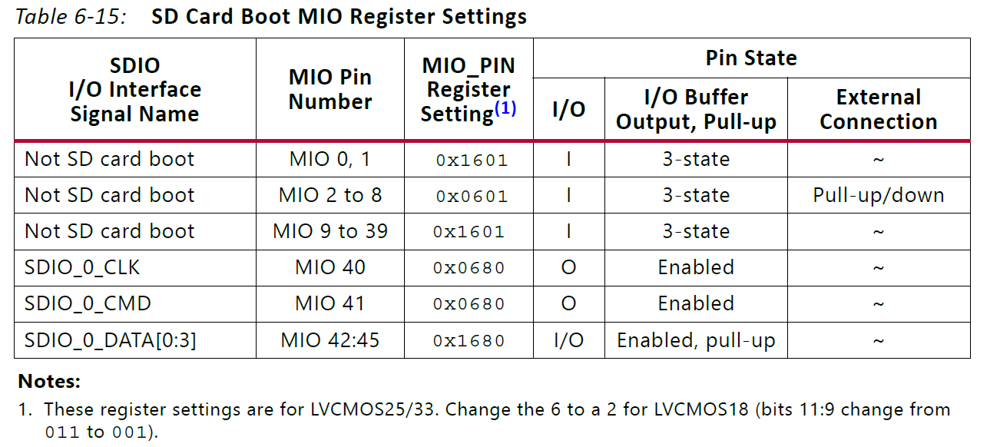

# Boot sequence

- [Boot sequence](#boot-sequence)
  - [List of Argots](#list-of-argots)
  - [POR and non-POR Reset](#por-and-non-por-reset)
  - [STAGE 0: BootROM](#stage-0-bootrom)
    - [QSPI Boot](#qspi-boot)
    - [NAND/NOR Flash Boot](#nandnor-flash-boot)
    - [SD Card Boot](#sd-card-boot)
    - [JTAG Boot](#jtag-boot)
  - [STAGE 1: FSBL](#stage-1-fsbl)
  - [STAGE 2: Operating System](#stage-2-operating-system)

## List of Argots

**POR** = Power-On Reset

**FSBL** = First Stage Boot Loader, a maximum 192KB bootstrap.

**OCM** = On-Chip Memory.

## POR and non-POR Reset

POR is controlled by the **low effective** pin PS_POR_B. It must be held low during the power ramp-up and the establishing of PS_CLK. When it is de-asserted, the booting sequence begins.
 
non-POR is controlled by PS_SRST_B, falling edge effective. It should be driven high 2us before the POR event. The AX7020 dev board simply tied it to 1.8V (BANK501 voltage).

PROGRAM_B controls the PL hardware reset, low effective. Asserting it will clear all registers in PL, then PL will wait for the new bitstream. It can be left high (3.3V for BANK 0?) if there is no need to re-program PL during operation.

## STAGE 0: BootROM

The BootROM can be executed by either POR or non-POR. It first determines where to load the FSBL from the voltage of strapping pins, then copies it to the OCM and runs it afterwards.

VMODES signals determine the voltage level of the two PS MIO bank. MIO[8] is for BANK 501, MIO[7] is for BANK 500, low for 2.5/3.3V and High for 1.8V. E.g. MIO[8] = 1 and MIO[7] = 0 indicate 1.8V for BANK 501 and 2.5/3.3V for BANK 500.

 - Use 20K resistors to tied them high or low.

### QSPI Boot

The QSPI Flash can be in single device mode with x1, x2 or x4 bit width, or dual device (Dual SS) mode with stacked x4 or parallel x8 configuration.

MIO Pins are configured as:

### NAND/NOR Flash Boot

Under construction...

### SD Card Boot

Needs up to 32GB SD/SDHC card with FAT16/32 file system.

### JTAG Boot

Under construction...

## STAGE 1: FSBL

BootROM hands over the CPU to FSBL in this stage. An FSBL normally setup the PS hardware including DDR controller and other peripherals.

The FSBL also configures the PL by bitstream if necessary. The bitstream is included in the .xsa file generated by Vivado. During the configuration, the INIT_B is driven low, and when it is done, the DONE outputs high. Both of the pins are in open drain topology.

When Petalinux is implemented, the FSBL launches the U-Boot sequence and initiates the Linux kernel.

## STAGE 2: Operating System

In Petalinux U-Boot (Universal Boot Loader) takes over in this stage. It loads the Linux kernel from the storage media (may be different from where the FSBL is?), reads the device tree, and so on.
